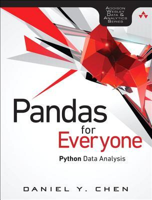
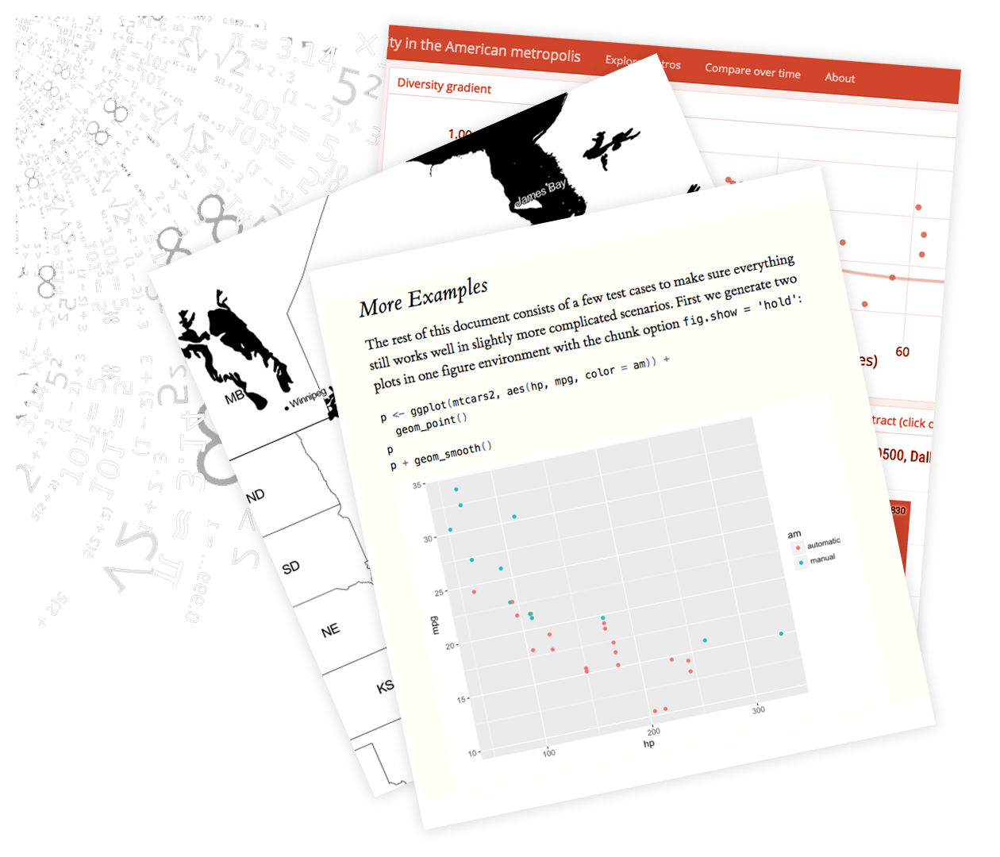

class: inverse

<style>
div.hello {
    font-size: 600px;
}

div.demo {
    font-size: 200px;
}

div.halfLink {
    font-size: 18px;
}

.container {
  height: 200px;
  position: relative;
  border: 3px solid green;
}

.vertical-center {
  margin: 0;
  position: absolute;
  top: 50%;
  -ms-transform: translateY(-50%);
  transform: translateY(-50%);
}

.tiny { font-size: 50% }
.small { font-size: 70% }
.large { font-size: 130% }
.huge { font-size: 100px }
</style>

<div class="my-footer"><span>Daniel Chen @chendaniely
&emsp;&emsp;&emsp;&emsp;&emsp;&emsp;&emsp;&emsp;&emsp;&emsp;&emsp;&emsp;&emsp;
DCR Conference 2019
&emsp;&emsp;&emsp;&emsp;&emsp;&emsp;&emsp;&emsp;&emsp;&emsp;&emsp;&emsp;&emsp;
https://github.com/chendaniely/rstatsdc_2019-python-r
</span></div> 


<center>
<div class="hello">hi!</div>
</center>

---
class: inverse
<div class="my-footer"><span>Daniel Chen @chendaniely
&emsp;&emsp;&emsp;&emsp;&emsp;&emsp;&emsp;&emsp;&emsp;&emsp;&emsp;&emsp;&emsp;
DCR Conference 2019
&emsp;&emsp;&emsp;&emsp;&emsp;&emsp;&emsp;&emsp;&emsp;&emsp;&emsp;&emsp;&emsp;
https://github.com/chendaniely/rstatsdc_2019-python-r
</span></div> 

# I'm Daniel
.pull-left[
</img>
]

.pull-right[
- PhD Student: Virginia Tech
  - Data Science education
  - Medical practitioners
-  Inten at RStudio
  - [`gradethis`](https://github.com/rstudio-education/gradethis)
  - Code grader for [`learnr`](https://github.com/rstudio/learnr) documents
- Author:
<center>
</img>
</center>
]

---
<div class="my-footer"><span>Daniel Chen @chendaniely
&emsp;&emsp;&emsp;&emsp;&emsp;&emsp;&emsp;&emsp;&emsp;&emsp;&emsp;&emsp;&emsp;
DCR Conference 2019
&emsp;&emsp;&emsp;&emsp;&emsp;&emsp;&emsp;&emsp;&emsp;&emsp;&emsp;&emsp;&emsp;
https://github.com/chendaniely/rstatsdc_2019-python-r
</span></div> 

# R and Python

.pull-left[
The Tiobe Index Top 10

Following are the top 10 languages in the June 2019 Tiobe index:

1. Java
1. C
1. **Python**
1. C
1. Visual
1. C
1. JavaScript
1. PHP
1. SQL
1. Assembly
]

.pull-right[
The Pypl Index Top 10

Following are the top 10 languages in the June 2018 Pypl index:

- **Python**
- Java
- JavaScript
- C
- PHP
- C
- **R**
- Objective
- Swift
- Matlab
]

<br><br><br>

.tiny[Taken from: https://www.infoworld.com/article/3401536/python-popularity-reaches-an-all-time-high.html]

---

<div class="my-footer"><span>Daniel Chen @chendaniely
&emsp;&emsp;&emsp;&emsp;&emsp;&emsp;&emsp;&emsp;&emsp;&emsp;&emsp;&emsp;&emsp;
DCR Conference 2019
&emsp;&emsp;&emsp;&emsp;&emsp;&emsp;&emsp;&emsp;&emsp;&emsp;&emsp;&emsp;&emsp;
https://github.com/chendaniely/rstatsdc_2019-python-r
</span></div> 

# Python...

... a general-purpose programming language.

- May not be the best at everything (anything?)
  - but second best at everthing is pretty good.

- Python does environments better than R (waiting to test out [`renv`](https://rstudio.github.io/renv/))
- One thing that Python is objectively better at than R is *Web Development* and *Hardware*


<center>

</center>

---

<div class="my-footer"><span>Daniel Chen @chendaniely
&emsp;&emsp;&emsp;&emsp;&emsp;&emsp;&emsp;&emsp;&emsp;&emsp;&emsp;&emsp;&emsp;
DCR Conference 2019
&emsp;&emsp;&emsp;&emsp;&emsp;&emsp;&emsp;&emsp;&emsp;&emsp;&emsp;&emsp;&emsp;
https://github.com/chendaniely/rstatsdc_2019-python-r
</span></div> 

# What *I* like about R

Communication

.pull-left[

]

.pull-right[

]

---
<div class="my-footer"><span>Daniel Chen @chendaniely
&emsp;&emsp;&emsp;&emsp;&emsp;&emsp;&emsp;&emsp;&emsp;&emsp;&emsp;&emsp;&emsp;
DCR Conference 2019
&emsp;&emsp;&emsp;&emsp;&emsp;&emsp;&emsp;&emsp;&emsp;&emsp;&emsp;&emsp;&emsp;
https://github.com/chendaniely/rstatsdc_2019-python-r
</span></div> 

# Inspiration for talk

2019 Nonclinical Biostatistics Conference

- https://github.com/chendaniely/ncb-2019-python

- Jupyter notebook
  - RISE plugin (reveal.js)
  - Slow and clunky
  - Unable to see source (nicely) without Jupyter loaded
- RMarkdown + Reticulate = Slides! (hint hint: this talk ;D)

---
class: inverse, center, middle
<div class="my-footer"><span>Daniel Chen @chendaniely
&emsp;&emsp;&emsp;&emsp;&emsp;&emsp;&emsp;&emsp;&emsp;&emsp;&emsp;&emsp;&emsp;
DCR Conference 2019
&emsp;&emsp;&emsp;&emsp;&emsp;&emsp;&emsp;&emsp;&emsp;&emsp;&emsp;&emsp;&emsp;
https://github.com/chendaniely/rstatsdc_2019-python-r
</span></div> 

# R and Python

---
<div class="my-footer"><span>Daniel Chen @chendaniely
&emsp;&emsp;&emsp;&emsp;&emsp;&emsp;&emsp;&emsp;&emsp;&emsp;&emsp;&emsp;&emsp;
DCR Conference 2019
&emsp;&emsp;&emsp;&emsp;&emsp;&emsp;&emsp;&emsp;&emsp;&emsp;&emsp;&emsp;&emsp;
https://github.com/chendaniely/rstatsdc_2019-python-r
</span></div> 

# R analysis - Load data

```{r, message=FALSE}
library(here)
library(readr)

raw = readr::read_csv(here::here("./data/billboard.csv"))
head(raw)
```

---
<div class="my-footer"><span>Daniel Chen @chendaniely
&emsp;&emsp;&emsp;&emsp;&emsp;&emsp;&emsp;&emsp;&emsp;&emsp;&emsp;&emsp;&emsp;
DCR Conference 2019
&emsp;&emsp;&emsp;&emsp;&emsp;&emsp;&emsp;&emsp;&emsp;&emsp;&emsp;&emsp;&emsp;
https://github.com/chendaniely/rstatsdc_2019-python-r
</span></div> 

# R analysis - Filter data

```{r, message=FALSE}
library(dplyr)

raw_filtered <- raw %>%
  dplyr::select(year, artist.inverted, track, time, date.entered,
                x1st.week:x73rd.week) %>%
  dplyr::rename(artist = artist.inverted)
raw_filtered
```

---
<div class="my-footer"><span>Daniel Chen @chendaniely
&emsp;&emsp;&emsp;&emsp;&emsp;&emsp;&emsp;&emsp;&emsp;&emsp;&emsp;&emsp;&emsp;
DCR Conference 2019
&emsp;&emsp;&emsp;&emsp;&emsp;&emsp;&emsp;&emsp;&emsp;&emsp;&emsp;&emsp;&emsp;
https://github.com/chendaniely/rstatsdc_2019-python-r
</span></div> 

# R analysis - Tidy data

```{r, message=FALSE}
library(tidyr)

raw_tidy <- raw_filtered %>%
  tidyr::pivot_longer(cols = tidyselect::starts_with('x'),
                      names_to = "week",
                      values_to = "rank")
raw_tidy
```

---

<div class="my-footer"><span>Daniel Chen @chendaniely
&emsp;&emsp;&emsp;&emsp;&emsp;&emsp;&emsp;&emsp;&emsp;&emsp;&emsp;&emsp;&emsp;
DCR Conference 2019
&emsp;&emsp;&emsp;&emsp;&emsp;&emsp;&emsp;&emsp;&emsp;&emsp;&emsp;&emsp;&emsp;
https://github.com/chendaniely/rstatsdc_2019-python-r
</span></div> 

# R analysis - Clean data

```{r, message=FALSE}
library(purrr)
library(stringr)

billboard_clean <- raw_tidy %>%
  dplyr::mutate(
    week = purrr::map_int(
      week,
      #function(x){as.integer(stringr::str_extract(x, '\\d+'))}
      ~ as.integer(stringr::str_extract(., "\\d+"))
    )
  )
billboard_clean
```

---
<div class="my-footer"><span>Daniel Chen @chendaniely
&emsp;&emsp;&emsp;&emsp;&emsp;&emsp;&emsp;&emsp;&emsp;&emsp;&emsp;&emsp;&emsp;
DCR Conference 2019
&emsp;&emsp;&emsp;&emsp;&emsp;&emsp;&emsp;&emsp;&emsp;&emsp;&emsp;&emsp;&emsp;
https://github.com/chendaniely/rstatsdc_2019-python-r
</span></div> 

# Python analysis

```{r, echo=FALSE, results='hide'}
library(reticulate)
(conda_envs <- reticulate::conda_list())
conda_envs$name[[1]]
env <- conda_envs$name[[1]]
reticulate::use_condaenv(env)
```


```{python}
import pandas as pd
import re

import janitor
from pyprojroot import here

raw_py = pd.read_csv(here('./data/billboard.csv'),
                     encoding = "ISO-8859-1")

billboard_clean_py = (
    raw_py
    .select_columns(['year', 'artist.inverted', 'track', 'time',
                     'date.entered', 'x*.week'])
    .rename_columns({"artist.inverted": "artist"})
    .melt(id_vars = ['year', 'artist', 'track', 'time',
                     'date.entered'],
          var_name = "week",
          value_name = "rank")
    .transform_column('week',
                      lambda x: int(re.findall(r'\d+', x)[0]))
)
```

---
<div class="my-footer"><span>Daniel Chen @chendaniely
&emsp;&emsp;&emsp;&emsp;&emsp;&emsp;&emsp;&emsp;&emsp;&emsp;&emsp;&emsp;&emsp;
DCR Conference 2019
&emsp;&emsp;&emsp;&emsp;&emsp;&emsp;&emsp;&emsp;&emsp;&emsp;&emsp;&emsp;&emsp;
https://github.com/chendaniely/rstatsdc_2019-python-r
</span></div> 

# Reticulate -- Python in R!

<center>

</center>

- Calling Python from R
- Translation between R and Python objects
- Python environments

---
<div class="my-footer"><span>Daniel Chen @chendaniely
&emsp;&emsp;&emsp;&emsp;&emsp;&emsp;&emsp;&emsp;&emsp;&emsp;&emsp;&emsp;&emsp;
DCR Conference 2019
&emsp;&emsp;&emsp;&emsp;&emsp;&emsp;&emsp;&emsp;&emsp;&emsp;&emsp;&emsp;&emsp;
https://github.com/chendaniely/rstatsdc_2019-python-r
</span></div> 

# Reticulate

```{r}
library(reticulate)
(conda_envs <- reticulate::conda_list())
```

```{r}
# use my default conda environment
conda_envs$name[[1]]
env <- conda_envs$name[[1]]
reticulate::use_condaenv(env)
```

```{r}
reticulate::py_config()
```


- The Python environment is registered for the entire R session.
- If you want to change environments you need to *restart R*

---

<div class="my-footer"><span>Daniel Chen @chendaniely
&emsp;&emsp;&emsp;&emsp;&emsp;&emsp;&emsp;&emsp;&emsp;&emsp;&emsp;&emsp;&emsp;
DCR Conference 2019
&emsp;&emsp;&emsp;&emsp;&emsp;&emsp;&emsp;&emsp;&emsp;&emsp;&emsp;&emsp;&emsp;
https://github.com/chendaniely/rstatsdc_2019-python-r
</span></div> 

# A Python script

```{python}
import pandas as pd
import re

import janitor
from pyprojroot import here

raw_py = pd.read_csv(here('./data/billboard.csv'),
                     encoding = "ISO-8859-1")

billboard_clean_py = (
    raw_py
    .select_columns(['year', 'artist.inverted', 'track', 'time',
                     'date.entered', 'x*.week'])
    .rename_columns({"artist.inverted": "artist"})
    .melt(id_vars = ['year', 'artist', 'track', 'time',
                     'date.entered'],
          var_name = "week",
          value_name = "rank")
    .transform_column('week',
                      lambda x: int(re.findall(r'\d+', x)[0]))
)

mean_rank_by_week = (billboard_clean_py.groupby("week")["rank"]
                     .mean())
```

---

<div class="my-footer"><span>Daniel Chen @chendaniely
&emsp;&emsp;&emsp;&emsp;&emsp;&emsp;&emsp;&emsp;&emsp;&emsp;&emsp;&emsp;&emsp;
DCR Conference 2019
&emsp;&emsp;&emsp;&emsp;&emsp;&emsp;&emsp;&emsp;&emsp;&emsp;&emsp;&emsp;&emsp;
https://github.com/chendaniely/rstatsdc_2019-python-r
</span></div> 

# Python objects in R

```{r}
reticulate::source_python(here::here("./scripts/01-02-python.py"))
```

```{r}
head(mean_rank_by_week)
```

```{r}
head(billboard_clean_py)
```


---

<div class="my-footer"><span>Daniel Chen @chendaniely
&emsp;&emsp;&emsp;&emsp;&emsp;&emsp;&emsp;&emsp;&emsp;&emsp;&emsp;&emsp;&emsp;
DCR Conference 2019
&emsp;&emsp;&emsp;&emsp;&emsp;&emsp;&emsp;&emsp;&emsp;&emsp;&emsp;&emsp;&emsp;
https://github.com/chendaniely/rstatsdc_2019-python-r
</span></div> 

# Type conversions table

<table class="table">
<thead><tr class="header">
<th>R</th>
<th>Python</th>
<th>Examples</th>
</tr></thead>
<tbody>
<tr class="odd">
<td>Single-element vector</td>
<td>Scalar</td>
<td>
<code>1</code>, <code>1L</code>, <code>TRUE</code>, <code>"foo"</code>
</td>
</tr>
<tr class="even">
<td>Multi-element vector</td>
<td>List</td>
<td>
<code>c(1.0, 2.0, 3.0)</code>, <code>c(1L, 2L, 3L)</code>
</td>
</tr>
<tr class="odd">
<td>List of multiple types</td>
<td>Tuple</td>
<td><code>list(1L, TRUE, "foo")</code></td>
</tr>
<tr class="even">
<td>Named list</td>
<td>Dict</td>
<td>
<code>list(a = 1L, b = 2.0)</code>, <code><a href="reference/dict.html">dict(x = x_data)</a></code>
</td>
</tr>
<tr class="odd">
<td>Matrix/Array</td>
<td>NumPy ndarray</td>
<td><code>matrix(c(1,2,3,4), nrow = 2, ncol = 2)</code></td>
</tr>
<tr class="even">
<td>Data Frame</td>
<td>Pandas DataFrame</td>
<td><code>data.frame(x = c(1,2,3), y = c("a", "b", "c"))</code></td>
</tr>
<tr class="odd">
<td>Function</td>
<td>Python function</td>
<td><code>function(x) x + 1</code></td>
</tr>
<tr class="even">
<td>NULL, TRUE, FALSE</td>
<td>None, True, False</td>
<td>
<code>NULL</code>, <code>TRUE</code>, <code>FALSE</code>
</td>
</tr>
</tbody>
</table>

.tiny[https://rstudio.github.io/reticulate/#type-conversions]

---
class: inverse, center, middle
<div class="my-footer"><span>Daniel Chen @chendaniely
&emsp;&emsp;&emsp;&emsp;&emsp;&emsp;&emsp;&emsp;&emsp;&emsp;&emsp;&emsp;&emsp;
DCR Conference 2019
&emsp;&emsp;&emsp;&emsp;&emsp;&emsp;&emsp;&emsp;&emsp;&emsp;&emsp;&emsp;&emsp;
https://github.com/chendaniely/rstatsdc_2019-python-r
</span></div> 

# Machine Learning

---
<div class="my-footer"><span>Daniel Chen @chendaniely
&emsp;&emsp;&emsp;&emsp;&emsp;&emsp;&emsp;&emsp;&emsp;&emsp;&emsp;&emsp;&emsp;
DCR Conference 2019
&emsp;&emsp;&emsp;&emsp;&emsp;&emsp;&emsp;&emsp;&emsp;&emsp;&emsp;&emsp;&emsp;
https://github.com/chendaniely/rstatsdc_2019-python-r
</span></div> 

# The data

No standard for how to transport data within a package...

```{python}
from sklearn.datasets import load_breast_cancer
cancer = load_breast_cancer()

print(type(cancer))
```

**vs**

```{python}
import seaborn as sns
tips = sns.load_dataset("tips")
print(type(tips))
```

---
<div class="my-footer"><span>Daniel Chen @chendaniely
&emsp;&emsp;&emsp;&emsp;&emsp;&emsp;&emsp;&emsp;&emsp;&emsp;&emsp;&emsp;&emsp;
DCR Conference 2019
&emsp;&emsp;&emsp;&emsp;&emsp;&emsp;&emsp;&emsp;&emsp;&emsp;&emsp;&emsp;&emsp;
https://github.com/chendaniely/rstatsdc_2019-python-r
</span></div> 

# The data

```{python}
cancer.target[:10]
```

```{python}
cancer.data[:10]
```

---

<div class="my-footer"><span>Daniel Chen @chendaniely
&emsp;&emsp;&emsp;&emsp;&emsp;&emsp;&emsp;&emsp;&emsp;&emsp;&emsp;&emsp;&emsp;
DCR Conference 2019
&emsp;&emsp;&emsp;&emsp;&emsp;&emsp;&emsp;&emsp;&emsp;&emsp;&emsp;&emsp;&emsp;
https://github.com/chendaniely/rstatsdc_2019-python-r
</span></div> 

# Python -- Preprocess
```{python, echo=FALSE}
import warnings
warnings.filterwarnings('ignore', category=FutureWarning)
```

```{python}
from sklearn.model_selection import train_test_split
from sklearn.preprocessing import MinMaxScaler
from sklearn.svm import SVC

# split the data
X_train, X_test, y_train, y_test = train_test_split(
    cancer.data, cancer.target, random_state=0)

# compute minimum and maximum on the training data
scaler = MinMaxScaler().fit(X_train)

# rescale training data
X_train_scaled = scaler.transform(X_train)
```

---
<div class="my-footer"><span>Daniel Chen @chendaniely
&emsp;&emsp;&emsp;&emsp;&emsp;&emsp;&emsp;&emsp;&emsp;&emsp;&emsp;&emsp;&emsp;
DCR Conference 2019
&emsp;&emsp;&emsp;&emsp;&emsp;&emsp;&emsp;&emsp;&emsp;&emsp;&emsp;&emsp;&emsp;
https://github.com/chendaniely/rstatsdc_2019-python-r
</span></div> 

# Python -- Fit

```{python}
svm = SVC()
# learn an SVM on the scaled training data
svm.fit(X_train_scaled, y_train)
```

---
<div class="my-footer"><span>Daniel Chen @chendaniely
&emsp;&emsp;&emsp;&emsp;&emsp;&emsp;&emsp;&emsp;&emsp;&emsp;&emsp;&emsp;&emsp;
DCR Conference 2019
&emsp;&emsp;&emsp;&emsp;&emsp;&emsp;&emsp;&emsp;&emsp;&emsp;&emsp;&emsp;&emsp;
https://github.com/chendaniely/rstatsdc_2019-python-r
</span></div> 

# Python -- Evaluate

```{python}
# scale test data and score the scaled data
X_test_scaled = scaler.transform(X_test)
svm.score(X_test_scaled, y_test)
```

.tiny[Default scoring metric is accuracy]

---
<div class="my-footer"><span>Daniel Chen @chendaniely
&emsp;&emsp;&emsp;&emsp;&emsp;&emsp;&emsp;&emsp;&emsp;&emsp;&emsp;&emsp;&emsp;
DCR Conference 2019
&emsp;&emsp;&emsp;&emsp;&emsp;&emsp;&emsp;&emsp;&emsp;&emsp;&emsp;&emsp;&emsp;
https://github.com/chendaniely/rstatsdc_2019-python-r
</span></div> 

# R -- Python setup

```{r}
library(reticulate)
# reticulate::use_condaenv("miniconda3")

(conda_envs <- reticulate::conda_list())
conda_envs$name[[1]]
env <- conda_envs$name[[1]]
reticulate::use_condaenv(env)
```

---
<div class="my-footer"><span>Daniel Chen @chendaniely
&emsp;&emsp;&emsp;&emsp;&emsp;&emsp;&emsp;&emsp;&emsp;&emsp;&emsp;&emsp;&emsp;
DCR Conference 2019
&emsp;&emsp;&emsp;&emsp;&emsp;&emsp;&emsp;&emsp;&emsp;&emsp;&emsp;&emsp;&emsp;
https://github.com/chendaniely/rstatsdc_2019-python-r
</span></div> 

# R -- Get data

```{r, warning=FALSE}
sklearn_datasets = reticulate::import_from_path("sklearn.datasets")
cancer = sklearn_datasets$load_breast_cancer()

library(tibble)
cancer_df <- tibble::as_tibble(cancer$data)
names(cancer_df) <- cancer$feature_names
cancer_df$target <- cancer$target
cancer_df
```

---
<div class="my-footer"><span>Daniel Chen @chendaniely
&emsp;&emsp;&emsp;&emsp;&emsp;&emsp;&emsp;&emsp;&emsp;&emsp;&emsp;&emsp;&emsp;
DCR Conference 2019
&emsp;&emsp;&emsp;&emsp;&emsp;&emsp;&emsp;&emsp;&emsp;&emsp;&emsp;&emsp;&emsp;
https://github.com/chendaniely/rstatsdc_2019-python-r
</span></div> 

# R -- Preprocess

```{r, message=FALSE}
library(rsample)
library(recipes)

cancer_split <- rsample::initial_split(cancer_df)
cancer_train <- rsample::training(cancer_split)
cancer_test <- rsample::testing(cancer_split)

res <- recipes::recipe(target ~ ., data = cancer_train) %>%
  recipes::step_scale(recipes::all_predictors()) %>%
  recipes::step_num2factor(recipes::all_outcomes())

res_preped <- res %>% recipes::prep()
res_baked <- res_preped %>% bake(new_data = cancer_train,
                                 composition = "tibble")
res_test <- res_preped %>% bake(new_data = cancer_test,
                                composition = "tibble")
```

---
<div class="my-footer"><span>Daniel Chen @chendaniely
&emsp;&emsp;&emsp;&emsp;&emsp;&emsp;&emsp;&emsp;&emsp;&emsp;&emsp;&emsp;&emsp;
DCR Conference 2019
&emsp;&emsp;&emsp;&emsp;&emsp;&emsp;&emsp;&emsp;&emsp;&emsp;&emsp;&emsp;&emsp;
https://github.com/chendaniely/rstatsdc_2019-python-r
</span></div> 

# R -- Fit

https://tidymodels.github.io/parsnip/articles/articles/Models.html

```{r}
library(parsnip)


svm <- parsnip::svm_rbf(mode = "classification", cost = 1) %>%
  parsnip::set_engine("kernlab") %>%
  parsnip::fit(target ~ ., data = res_baked)
```

---
<div class="my-footer"><span>Daniel Chen @chendaniely
&emsp;&emsp;&emsp;&emsp;&emsp;&emsp;&emsp;&emsp;&emsp;&emsp;&emsp;&emsp;&emsp;
DCR Conference 2019
&emsp;&emsp;&emsp;&emsp;&emsp;&emsp;&emsp;&emsp;&emsp;&emsp;&emsp;&emsp;&emsp;
https://github.com/chendaniely/rstatsdc_2019-python-r
</span></div> 

# R -- Evaluate

```{r, message=FALSE}
library(yardstick)
predict(svm, res_test) %>%
  dplyr::bind_cols(res_test %>% dplyr::select(target)) %>%
  yardstick::accuracy(truth = target, estimate = .pred_class)
```

---
class: inverse, center, middle
<div class="my-footer"><span>Daniel Chen @chendaniely
&emsp;&emsp;&emsp;&emsp;&emsp;&emsp;&emsp;&emsp;&emsp;&emsp;&emsp;&emsp;&emsp;
DCR Conference 2019
&emsp;&emsp;&emsp;&emsp;&emsp;&emsp;&emsp;&emsp;&emsp;&emsp;&emsp;&emsp;&emsp;
https://github.com/chendaniely/rstatsdc_2019-python-r
</span></div> 

# Communication

---
<div class="my-footer"><span>Daniel Chen @chendaniely
&emsp;&emsp;&emsp;&emsp;&emsp;&emsp;&emsp;&emsp;&emsp;&emsp;&emsp;&emsp;&emsp;
DCR Conference 2019
&emsp;&emsp;&emsp;&emsp;&emsp;&emsp;&emsp;&emsp;&emsp;&emsp;&emsp;&emsp;&emsp;
https://github.com/chendaniely/rstatsdc_2019-python-r
</span></div> 

# This presentation

- Written in RMarkdown exported as a [xaringan](https://github.com/yihui/xaringan) slide deck
- All the R **and** Python code are live executed by changing the execution engine

````markdown
`r ''````{r}
library(reticulate)
reticulate::use_condaenv("Anaconda3")
```

`r ''````{python}
from sklearn.datasets import load_breast_cancer
cancer = load_breast_cancer()
```
````

---
<div class="my-footer"><span>Daniel Chen @chendaniely
&emsp;&emsp;&emsp;&emsp;&emsp;&emsp;&emsp;&emsp;&emsp;&emsp;&emsp;&emsp;&emsp;
DCR Conference 2019
&emsp;&emsp;&emsp;&emsp;&emsp;&emsp;&emsp;&emsp;&emsp;&emsp;&emsp;&emsp;&emsp;
https://github.com/chendaniely/rstatsdc_2019-python-r
</span></div> 

# Sharing objects R < -- > Python

- In R chunks, you can access python objects with: `py$`
- In Python chunks, you can access R objects with: `r.`
  - Note the dot in `r.`

In Python chunk:

```{python}
single_obs_py = X_test_scaled[:1, :] # first row of the test data
single_obs_py
```

In R chunk:

```{r}
single_obs_r <-py$single_obs_py # get an R object
```

---
<div class="my-footer"><span>Daniel Chen @chendaniely
&emsp;&emsp;&emsp;&emsp;&emsp;&emsp;&emsp;&emsp;&emsp;&emsp;&emsp;&emsp;&emsp;
DCR Conference 2019
&emsp;&emsp;&emsp;&emsp;&emsp;&emsp;&emsp;&emsp;&emsp;&emsp;&emsp;&emsp;&emsp;
https://github.com/chendaniely/rstatsdc_2019-python-r
</span></div> 

# Python -- Prediction

```{python}
svm.predict(single_obs_py) # using python variable
```

```{python}
svm.predict(r.single_obs_r) # using R variable
```

---
<div class="my-footer"><span>Daniel Chen @chendaniely
&emsp;&emsp;&emsp;&emsp;&emsp;&emsp;&emsp;&emsp;&emsp;&emsp;&emsp;&emsp;&emsp;
DCR Conference 2019
&emsp;&emsp;&emsp;&emsp;&emsp;&emsp;&emsp;&emsp;&emsp;&emsp;&emsp;&emsp;&emsp;
https://github.com/chendaniely/rstatsdc_2019-python-r
</span></div> 

# R -- Prediction

```{r}
r_dat <- as.data.frame(single_obs_r)
names(r_dat) <- py$cancer$feature_names
predict(svm, r_dat)
```

---
<div class="my-footer"><span>Daniel Chen @chendaniely
&emsp;&emsp;&emsp;&emsp;&emsp;&emsp;&emsp;&emsp;&emsp;&emsp;&emsp;&emsp;&emsp;
DCR Conference 2019
&emsp;&emsp;&emsp;&emsp;&emsp;&emsp;&emsp;&emsp;&emsp;&emsp;&emsp;&emsp;&emsp;
https://github.com/chendaniely/rstatsdc_2019-python-r
</span></div> 

# Shiny

https://scikit-learn.org/stable/modules/model_persistence.html


Save out the model
```{python}
from joblib import dump, load
from pyprojroot import here

dump(svm, here("output/python_model.joblib", warn=False))
```

Load the model

```{python}
python_model = load(here("output/python_model.joblib")) 
```

---
<div class="my-footer"><span>Daniel Chen @chendaniely
&emsp;&emsp;&emsp;&emsp;&emsp;&emsp;&emsp;&emsp;&emsp;&emsp;&emsp;&emsp;&emsp;
DCR Conference 2019
&emsp;&emsp;&emsp;&emsp;&emsp;&emsp;&emsp;&emsp;&emsp;&emsp;&emsp;&emsp;&emsp;
https://github.com/chendaniely/rstatsdc_2019-python-r
</span></div> 

# Shiny

https://github.com/chendaniely/rstatsdc_2019-python-r/blob/master/shiny_example.Rmd

````markdown
`r ''````{r}
inputPanel(
  sliderInput("bw_adjust", label = "Bandwidth adjustment:",
              min = 1, max = 20, value = 1, step = 1)
)

renderText({
  py$python_model$predict(py$X_test_scaled[1:input$bw_adjust, , drop=FALSE])
})
```
````

---
<div class="my-footer"><span>Daniel Chen @chendaniely
&emsp;&emsp;&emsp;&emsp;&emsp;&emsp;&emsp;&emsp;&emsp;&emsp;&emsp;&emsp;&emsp;
DCR Conference 2019
&emsp;&emsp;&emsp;&emsp;&emsp;&emsp;&emsp;&emsp;&emsp;&emsp;&emsp;&emsp;&emsp;
https://github.com/chendaniely/rstatsdc_2019-python-r
</span></div> 

# The -down ecosystem

All of this is using the `reticulate` R package

https://rstudio.github.io/reticulate/

- Bookdown
- Blogdown
  - Hugo academic already supports Jupyter notebooks
  - https://sourcethemes.com/academic/docs/jupyter


## By the way...

- `knitpy`: https://github.com/jankatins/knitpy
- `jupyter books`: https://jupyterbook.org/intro.html

---
<div class="my-footer"><span>Daniel Chen @chendaniely
&emsp;&emsp;&emsp;&emsp;&emsp;&emsp;&emsp;&emsp;&emsp;&emsp;&emsp;&emsp;&emsp;
DCR Conference 2019
&emsp;&emsp;&emsp;&emsp;&emsp;&emsp;&emsp;&emsp;&emsp;&emsp;&emsp;&emsp;&emsp;
https://github.com/chendaniely/rstatsdc_2019-python-r
</span></div> 

# Creating a reticulated R package

The R keras package is an R wrapper around keras for Python
  - https://keras.rstudio.com/

https://rstudio.github.io/reticulate/articles/package.html

---
<div class="my-footer"><span>Daniel Chen @chendaniely
&emsp;&emsp;&emsp;&emsp;&emsp;&emsp;&emsp;&emsp;&emsp;&emsp;&emsp;&emsp;&emsp;
DCR Conference 2019
&emsp;&emsp;&emsp;&emsp;&emsp;&emsp;&emsp;&emsp;&emsp;&emsp;&emsp;&emsp;&emsp;
https://github.com/chendaniely/rstatsdc_2019-python-r
</span></div> 

# Installing Python...

I recommend looking at the Software-Carpentry setup instructions:

https://swcarpentry.github.io/python-novice-inflammation/setup/index.html

Most people in data science use Anaconda to install Python

- https://www.anaconda.com/distribution/

People who mainly use python for Web development don't use Anaconda

---
<div class="my-footer"><span>Daniel Chen @chendaniely
&emsp;&emsp;&emsp;&emsp;&emsp;&emsp;&emsp;&emsp;&emsp;&emsp;&emsp;&emsp;&emsp;
DCR Conference 2019
&emsp;&emsp;&emsp;&emsp;&emsp;&emsp;&emsp;&emsp;&emsp;&emsp;&emsp;&emsp;&emsp;
https://github.com/chendaniely/rstatsdc_2019-python-r
</span></div> 

# About conda..

What they forgot to teach you about R: https://rstats.wtf/

There's a section about using conda with R:
https://rstats.wtf/set-up-an-r-dev-environment.html#what-about-conda

tl;dr - don't mix `conda install` with `install.packages()`

---
<div class="my-footer"><span>Daniel Chen @chendaniely
&emsp;&emsp;&emsp;&emsp;&emsp;&emsp;&emsp;&emsp;&emsp;&emsp;&emsp;&emsp;&emsp;
DCR Conference 2019
&emsp;&emsp;&emsp;&emsp;&emsp;&emsp;&emsp;&emsp;&emsp;&emsp;&emsp;&emsp;&emsp;
https://github.com/chendaniely/rstatsdc_2019-python-r
</span></div> 

# Apache arrow

If you heard me speak before...

- DCR 2018: Structuring Your Data Science Projects
  - https://youtu.be/UQHz38s3DyA
- NYR 2019: Building Reproducible and Replicable Projects
  - https://youtu.be/t-vY9FeIIMk

Save out data objects to share between Python and R scripts

- Python: https://arrow.apache.org/docs/python/
- R: https://arrow.apache.org/docs/r/

---

class: center, middle, inverse

# Thanks!

@chendaniely

Slides: https://github.com/chendaniely/rstatsdc_2019-python-r
